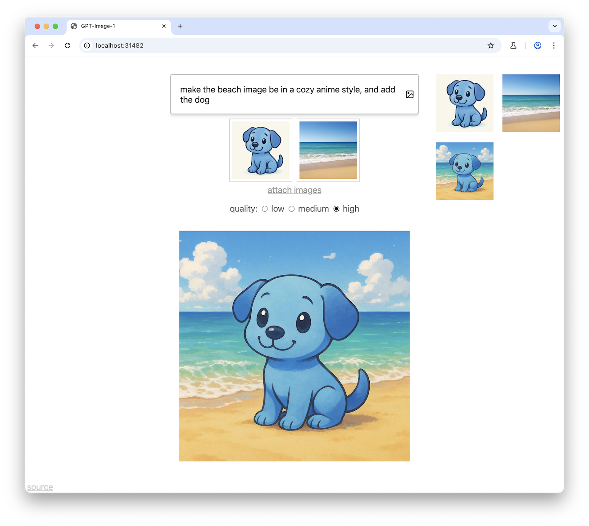

# Simple DALL-E UI

A simple static webpage to wrap OpenAI's image-generating DALL-E API.

If you have your own OpenAI API key, you can try it <a href="https://bakkot.github.io/simple-dalle-ui">here</a>.

## TODO

Doesn't support changing sizes.

## Deploying

If you want to deploy this locally so you don't have to enter the key every time, a trivial server is included. Letting people access a hosted copy will give them the ability to generate images, but not otherwise access your key.

When deployed locally all generated images will be saved to disk, unless you change `SAVE_OUTPUTS` to `false`.

- Clone the repo
- `npm install` to install dependencies
- Edit `page.js` to have `USES_SERVER = true` instead of `false`
- Put your OpenAI key in a file named `OPENAI_KEY.txt`
- `node run.js`

## Implementation details

History is stored in the [origin private file system](https://developer.mozilla.org/en-US/docs/Web/API/File_System_API/Origin_private_file_system).
