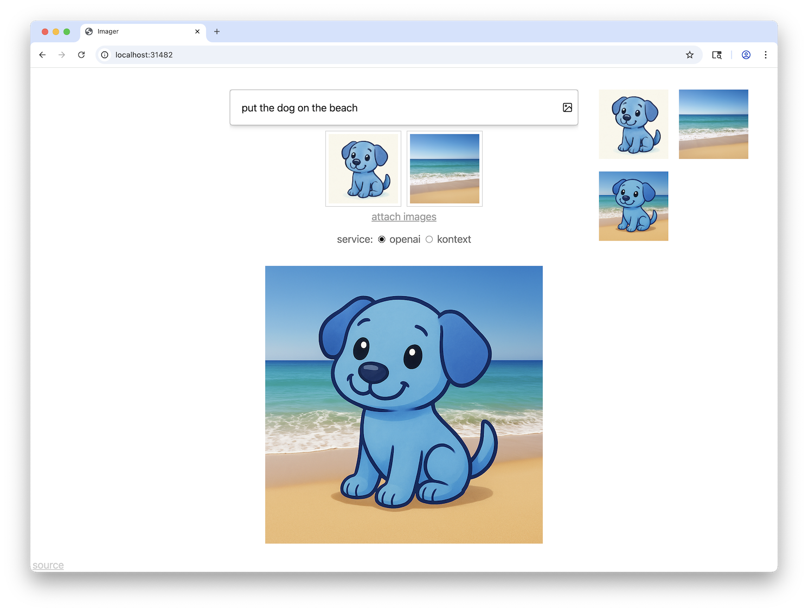

# Simple DALL-E/gpt-image-1 UI

A simple static webpage to wrap OpenAI's image-generating gpt-image-1 API and the [image-editing FLUX.1 Kontext](https://replicate.com/black-forest-labs/flux-kontext-pro) from Replicate. You can dig the DALL-E wrapper out of the commit history if you like the old one better.



## Deploying

Put a list of usernames to allow in `ALLOWED_USERS.txt`, one per line. This is not intended as a security feature, just something to help keep track of where usage is going.

Ensure you have a reasonably recent version of node installed. Then

```sh
npm ci
node run.ts
```

If you are using a version of node prior to 23.6.0, you will likely need to include `--experimental-strip-types` after the `node` command.

You will need an OpenAI API key in `OPENAI_KEY.txt` and a Replicate API key in `REPLICATE_API_KEY`. If you don't care about one or the other you can use an empty file and then just not submit requests to that one.
